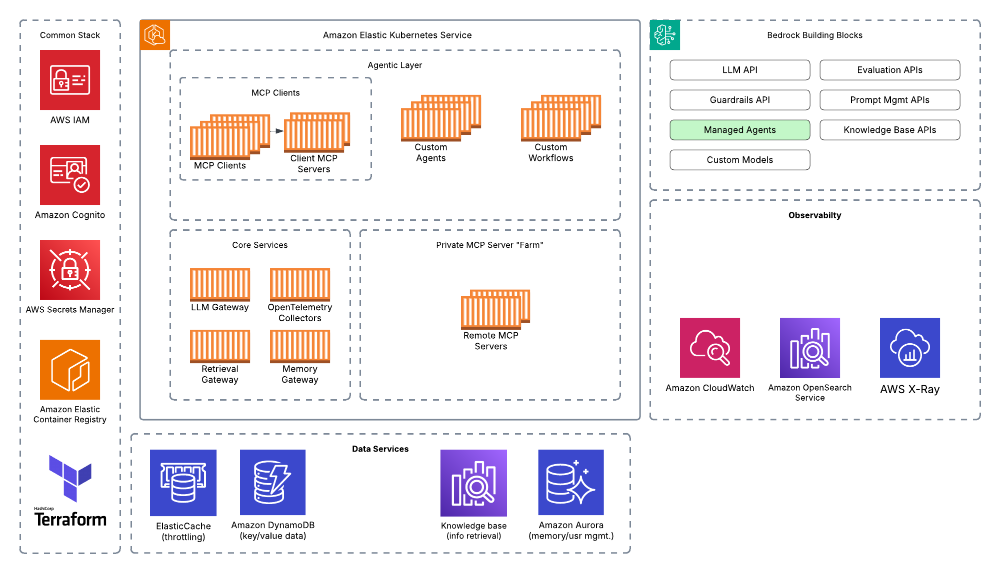
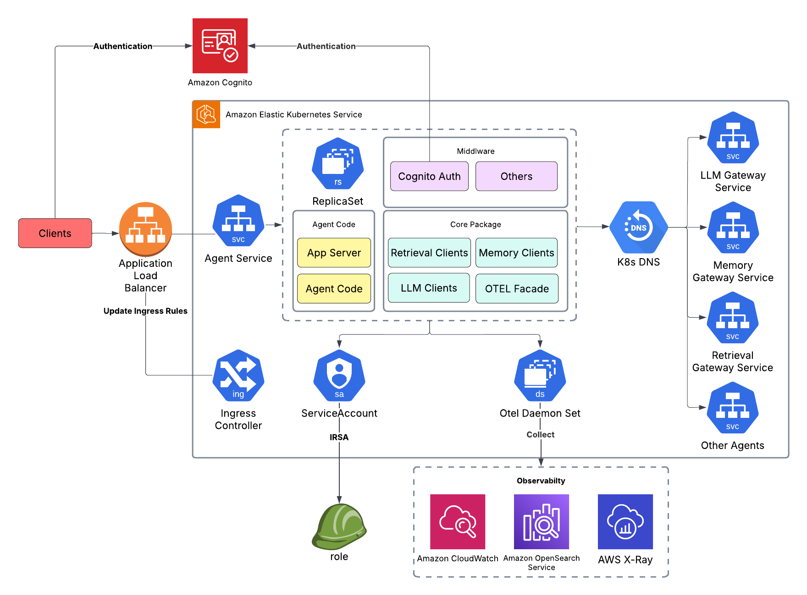

# Agentic Platform
A modular repository demonstrating how to build an agentic platform including labs and a deployable sample "agentic platform" to demonstrate how to operatinalize agents from multiple open source frameworks as well as Bedrock agents.

## Project status
This sample is active as of 4/22/2025.

# Architecture
## High Level Architecture


The sample platform is built on EKS uses a variety of AWS services to deploy 10+ agentic systems demonstrating how everything works together. It's instrumented with telemetry and demonstrates operational considerations when deploying agents. Code is written in an abstracted/modular way to make it easy to switch the underlying infrastructure components to suite your needs.

## Agent Process Architecture

Each agent runs as a FastAPI server sharing a core package which contains types and client abstrations (like LLM API provider). APIs are authenticated using Cognito through a middleware layer that's simple to swap out for your own IDP. 

The agents themselves do not have IAM roles attached to them. Instead they connect to AWS resources through microservices like the LLM Gateway, Memory Gateway, and Retrieval Gateway (which do have IAM roles through IRSA). Those requests are authenticated by passing JWT tokens between each request. Each pod running in EKS is authenticated using oAuth regardless of whether the request was service <> service or user <> service by validating tokens against the IDP's public cert.

Lastly, telemetry information is collected using open telemetry collectors and pushed to X-Ray for traces, Cloudwatch for metrics, and OpenSearch for logs. An agent uses the observability facade (in the common package) which is pre-configured to send to our open telemetry endpoints. The OTEL collectors then push the telemetry data to any endpoint that supports open telemetry protocol (OTLP). This makes it easy to switch vendors or different services. Anything that supports OTLP will work.


# Pre-requisites
You'll need to have terraform installed and the AWS CLI installed in the environment you want to deploy this code from

1. [Install Terraform using tfenv](https://github.com/tfutils/tfenv)
2. [Install AWS CLI & configure](https://docs.aws.amazon.com/cli/latest/userguide/getting-started-install.html)
3. [Install SSM Plugin for the AWS CLI for Port Forwarding](https://docs.aws.amazon.com/systems-manager/latest/userguide/session-manager-working-with-install-plugin.html)
4. "Optionally" configure a bucket and dynamoDB table to store terraform state.
5. Install [uv](https://github.com/astral-sh/uv) for local python development.
6. Install [Docker](https://docs.docker.com/engine/install/)
7. Install [kubectl](https://kubernetes.io/docs/tasks/tools/)

# Installation
Run git clone on this repo:
```bash
git clone https://github.com/aws-samples/sample-agentic-platform.git
```

**Important Notice:** This project deploys resources in your AWS environment using Terraform. You will incur costs for the AWS resources used. Please be aware of the pricing for services like EKS, Bedrock, OpenSearch, DynamoDB, Elasticache, S3, etc.. in your AWS region.

Required Permissions: You need elevated permissions, to deploy the Terraform stack.

# Deployment
Please refer to the DEPLOYMENT.md file for details on how to deploy.

# Labs
There are 5 modules in total that increase in complexity going from the basics to operational considerations when running an agent platform at scale. Only module 5 needs the agent platform deployed to fully run the notebooks. To deploy the agent platform skip to the **Deploy Sample Agent Platform** section.

You can run the labs locally or within the bastion host. In the deployment, we've provided a code server that can be accessed in your browser by port forwarding through SSM.

If running the lab locally, you'll need to have UV installed:
* Install [uv](https://github.com/astral-sh/uv) for local python development.

When you have your environment setup, go into the sample-agentic-platform directory and run uv sync.
```bash
uv sync 
```

If you're running the lab locally, run the following command to start the lab
```bash
uv run jupyter lab
```

## Security
Make sure to run checkov, bandit, and gitleaks if making additional changes to the code. 
* [Checkov](https://www.checkov.io/2.Basics/Installing%20Checkov.html)
* [Bandit](https://bandit.readthedocs.io/en/latest/)
* [Gitleaks](https://github.com/gitleaks/gitleaks)

**Suppressed Warnings**: 

There are a number of warnings suppressed in the code base. Review these prior to using any of the code in your environment. For example, we suppressed warnings on automatic secret rotation in AWS Secrets Manager for the redis and postgres passwords.

See [CONTRIBUTING](CONTRIBUTING.md#security-issue-notifications) for more information.

## Contributing
We are open to contributions and this project is actively being worked on. A couple things on your roadmap include:
1. Making deployment easier through a bootstrap terraform module
2. Cleaning up deployments with a more structured approach to GitOps
3. Adding additional labs on more advanced agent topics. 
4. Building a test harness & eval suite that runs against the code base
5. Adding more agent examples from the labs into the sample platform
6. 

For people who want to make changes to your project, it's helpful to have some documentation on how to get started. Perhaps there is a script that they should run or some environment variables that they need to set. Make these steps explicit. These instructions could also be useful to your future self.

You can also document commands to lint the code or run tests. These steps help to ensure high code quality and reduce the likelihood that the changes inadvertently break something. Having instructions for running tests is especially helpful if it requires external setup, such as starting a Selenium server for testing in a browser.

## Authors and acknowledgment
Show your appreciation to those who have contributed to the project.

## License

This library is licensed under the MIT-0 License. See the LICENSE file.
